# AKX Architecture Overview

**A self-extending runtime where the language grows itself.**

## The Big Picture

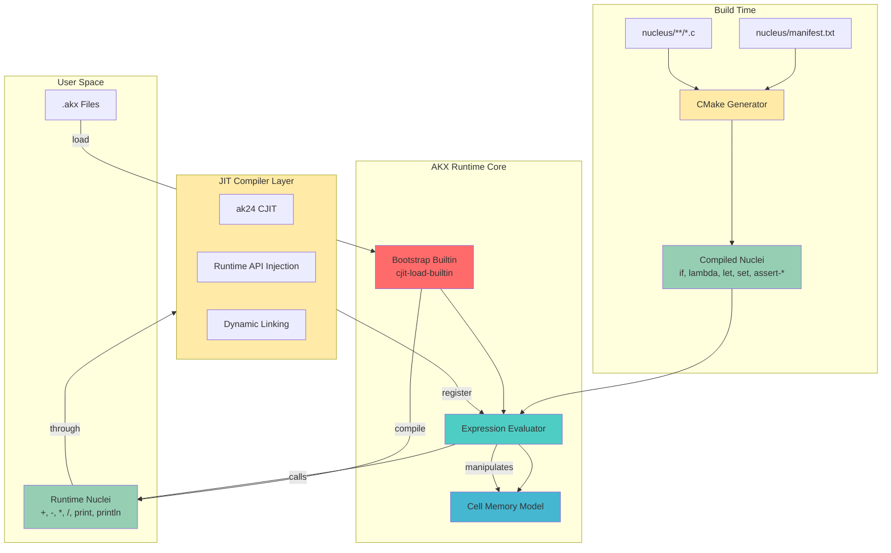

## Bootstrap Flow

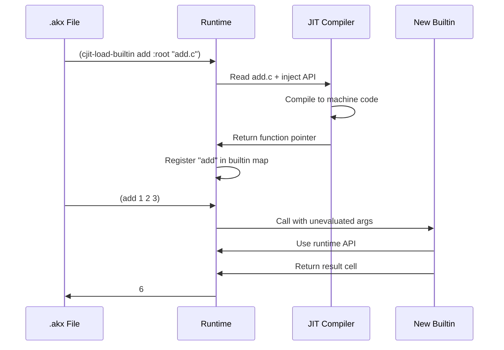

## Cell Memory Model

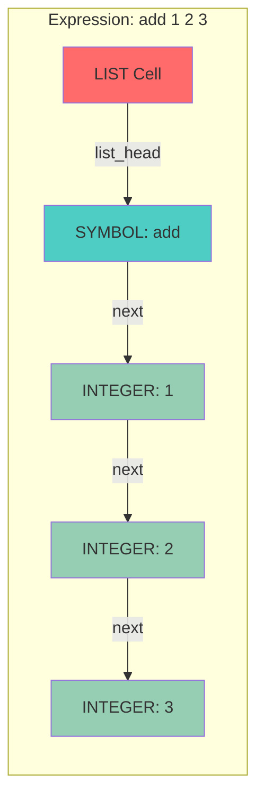

## The Power Move: Hot Reloading

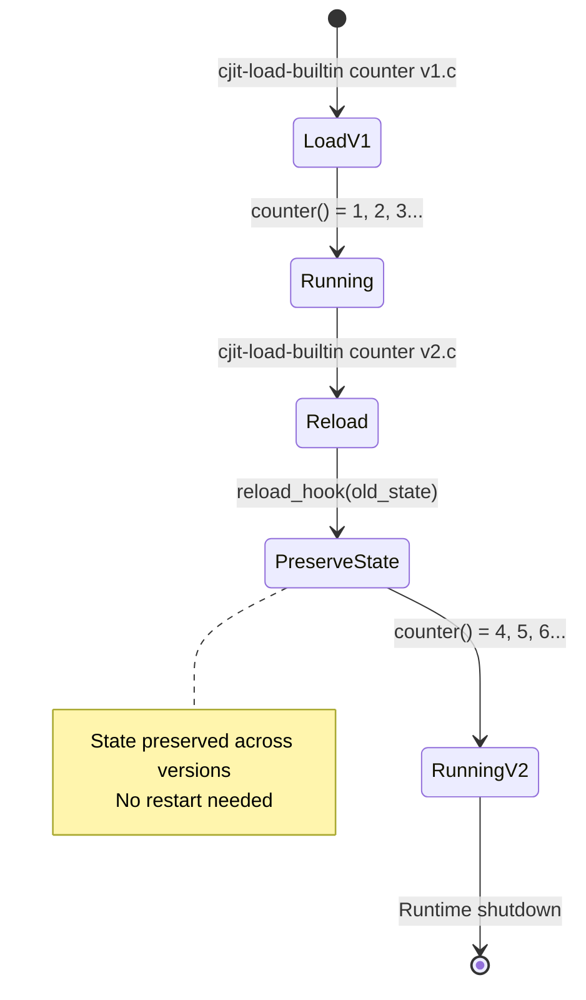

## Compilation Pipeline

```mermaid
flowchart LR
    subgraph Input
        Root[Root C File]
        Impl[Implementation Files]
        Headers[Include Paths]
    end
    
    subgraph Compile[JIT Compilation]
        API[Inject Runtime API]
        Combine[Combine Sources]
        Defines[Apply Defines]
        Compile2[Compile to Machine Code]
    end
    
    subgraph Link[Dynamic Linking]
        Symbols[Link Runtime Symbols]
        Libs[Link Libraries]
        Relocate[Relocate Code]
    end
    
    subgraph Register[Registration]
        Extract[Extract Function Pointer]
        Hooks[Find Lifecycle Hooks]
        Map[Add to Builtin Map]
    end
    
    Input --> Compile
    Compile --> Link
    Link --> Register
    Register --> Callable[Callable from AKX]
    
    style Compile fill:#ffeaa7
    style Link fill:#ff6b6b
    style Register fill:#4ecdc4
    style Callable fill:#96ceb4
```

## Keyword Argument System

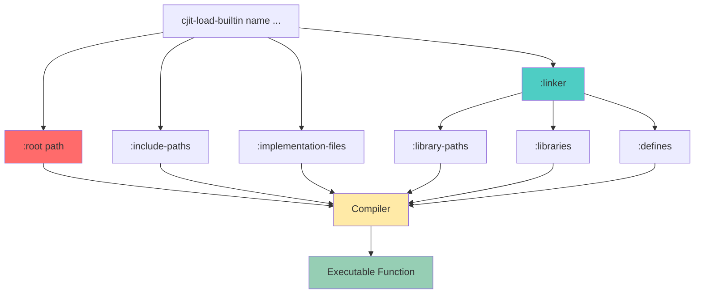

## The Nucleus System: Unified Builtin Architecture

AKX uses a **nucleus architecture** where all builtins are standalone C files that can be either compiled into the binary or loaded at runtime via CJIT.

### Nucleus Directory Structure

```
nucleus/
├── manifest.txt          # Single source of truth for all nuclei
├── CMakeLists.txt       # Auto-generates registration code
├── core/                # Core language primitives
│   ├── if.c
│   ├── lambda.c
│   ├── let.c
│   └── set.c
├── assert/              # Assertion functions
│   ├── assert_true.c
│   ├── assert_false.c
│   ├── assert_eq.c
│   └── assert_ne.c
├── math/                # Mathematical operators
│   ├── add.c
│   ├── sub.c
│   ├── mul.c
│   ├── div.c
│   ├── mod.c
│   └── eq.c
└── io/                  # I/O operations
    ├── print.c
    └── println.c
```

### The Manifest

`nucleus/manifest.txt` defines all available nuclei:

```
# Format: SYMBOL C_FUNCTION_NAME RELATIVE_PATH COMPILE_IN
# COMPILE_IN: 1=compile into binary, 0=load at runtime

# Core language (always compiled in)
if          if_impl         core/if.c           1
lambda      lambda_impl     core/lambda.c       1
let         let_impl        core/let.c          1
set         set_impl        core/set.c          1

# Math operators (runtime loadable)
+           add             math/add.c          0
-           sub             math/sub.c          0
```

### Build-Time Code Generation

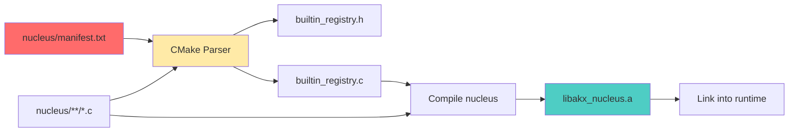

At build time, CMake:
1. Parses `manifest.txt`
2. Identifies which nuclei have `COMPILE_IN=1`
3. Generates `builtin_registry.c` with registration code
4. Includes nucleus source files inline
5. Creates `libakx_nucleus.a` library

### Runtime Initialization

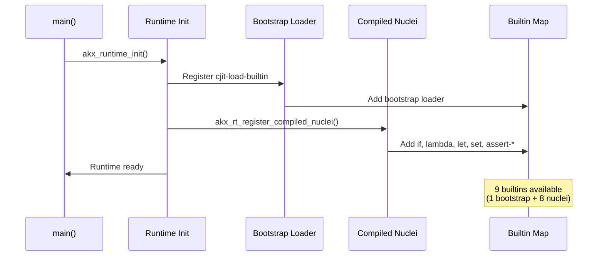

### Deployment Flexibility

The same nucleus can be used in three ways:

#### 1. Compiled-In (Fast, Static)
```c
// Set COMPILE_IN=1 in manifest.txt
// Nucleus compiled into binary at build time
(if 1 "yes" "no")  // Immediate, no loading needed
```

#### 2. Runtime-Loaded (Flexible, Dynamic)
```lisp
// Set COMPILE_IN=0 in manifest.txt
// Load nucleus at runtime via CJIT
(cjit-load-builtin + :root "nucleus/math/add.c" :as "add")
(+ 1 2 3)  // Now available
```

#### 3. Hot-Reloaded (Development, Live Updates)
```lisp
// Even compiled-in nuclei can be replaced
(cjit-load-builtin if :root "nucleus/core/if_v2.c" :as "if_impl")
// Old compiled version replaced with new JIT version
```

### Current Configuration

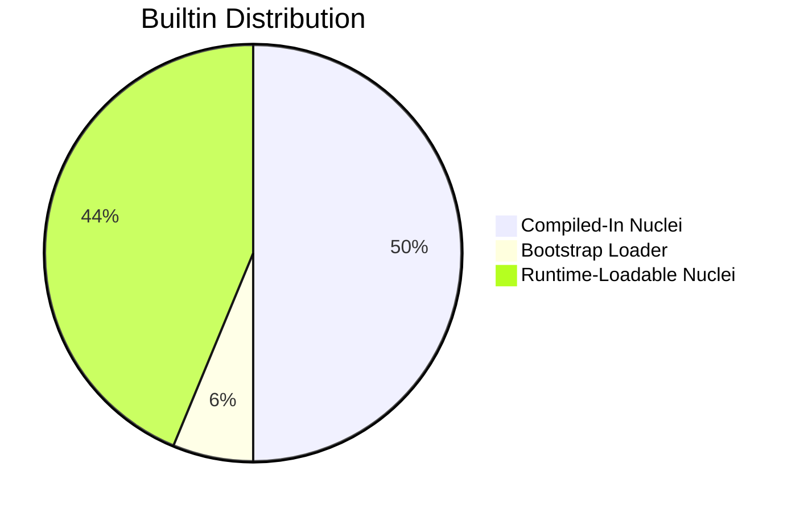

**Compiled-In (8):** if, lambda, let, set, assert-true, assert-false, assert-eq, assert-ne  
**Runtime-Loadable (7):** +, -, *, /, %, =, print, println  
**Bootstrap (1):** cjit-load-builtin

### Benefits

1. **Single Source of Truth** - Each builtin is one `.c` file
2. **Flexible Deployment** - Manifest controls compilation strategy
3. **Automatic Registration** - CMake generates all registration code
4. **Hot Reload Everything** - Even compiled nuclei can be replaced
5. **No Duplication** - Same code works compiled or JIT-loaded

## Module Lifecycle

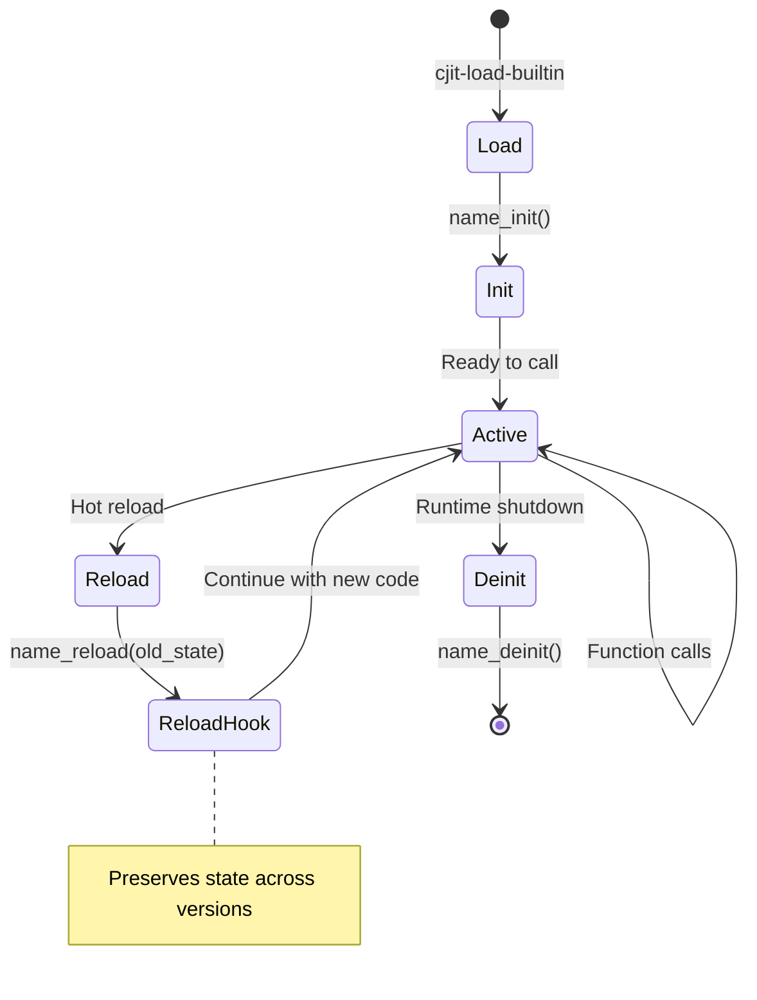

## What Makes This Special

### Traditional Language


### AKX


**The language defines itself. At runtime. Repeatedly.**

## Tail Call Optimization

AKX implements a trampoline-based tail call optimization system that eliminates recursion depth limits:

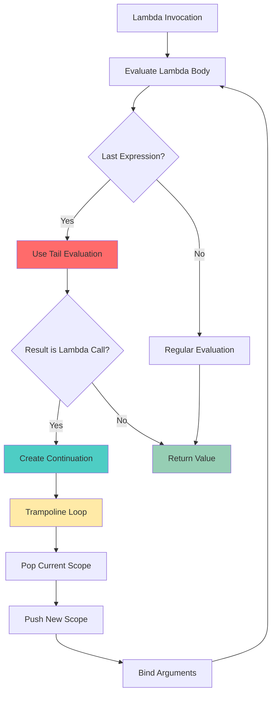

### How It Works

1. **Continuation Detection**: When evaluating the last expression in a lambda body, the runtime uses `akx_rt_eval_tail()` instead of regular evaluation
2. **Continuation Creation**: If the tail expression is a lambda call, a continuation cell is created instead of invoking the lambda
3. **Trampoline Loop**: The `akx_rt_invoke_lambda()` function runs an iterative loop that:
   - Invokes the lambda and gets the result
   - If the result is a continuation, extracts the next lambda and arguments
   - Pops the old scope and pushes a new scope
   - Repeats until a non-continuation result is obtained
4. **No C Stack Recursion**: All tail calls are handled iteratively, eliminating stack overflow

## Creating a New Nucleus

Adding a new builtin to AKX is simple:

### 1. Create the Nucleus File

```c
// nucleus/math/pow.c
akx_cell_t *pow_impl(akx_runtime_ctx_t *rt, akx_cell_t *args) {
    akx_cell_t *base_cell = akx_rt_list_nth(args, 0);
    akx_cell_t *exp_cell = akx_rt_list_nth(args, 1);
    
    akx_cell_t *base = akx_rt_eval_and_assert(rt, base_cell, 
        AKX_TYPE_INTEGER_LITERAL, "pow: base must be integer");
    if (!base) return NULL;
    
    akx_cell_t *exp = akx_rt_eval_and_assert(rt, exp_cell,
        AKX_TYPE_INTEGER_LITERAL, "pow: exponent must be integer");
    if (!exp) {
        akx_rt_free_cell(rt, base);
        return NULL;
    }
    
    int result = 1;
    int b = akx_rt_cell_as_int(base);
    int e = akx_rt_cell_as_int(exp);
    
    for (int i = 0; i < e; i++) {
        result *= b;
    }
    
    akx_rt_free_cell(rt, base);
    akx_rt_free_cell(rt, exp);
    
    akx_cell_t *ret = akx_rt_alloc_cell(rt, AKX_TYPE_INTEGER_LITERAL);
    akx_rt_set_int(rt, ret, result);
    return ret;
}
```

### 2. Add to Manifest

```txt
# nucleus/manifest.txt
pow         pow_impl        math/pow.c          0
```

### 3. Rebuild

```bash
cd build && cmake .. && make
```

### 4. Use It

```lisp
# Load at runtime
(cjit-load-builtin pow :root "nucleus/math/pow.c" :as "pow_impl")
(let result (pow 2 8))  # 256

# Or set COMPILE_IN=1 to have it always available
```

That's it! The nucleus is now part of the language.

## Data Flow

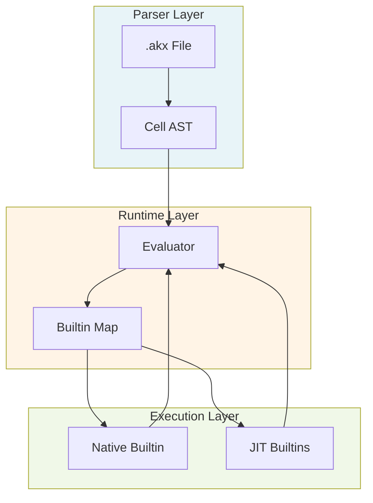

