# AKX Architecture Overview

**A self-extending runtime where the language grows itself.**

## The Big Picture

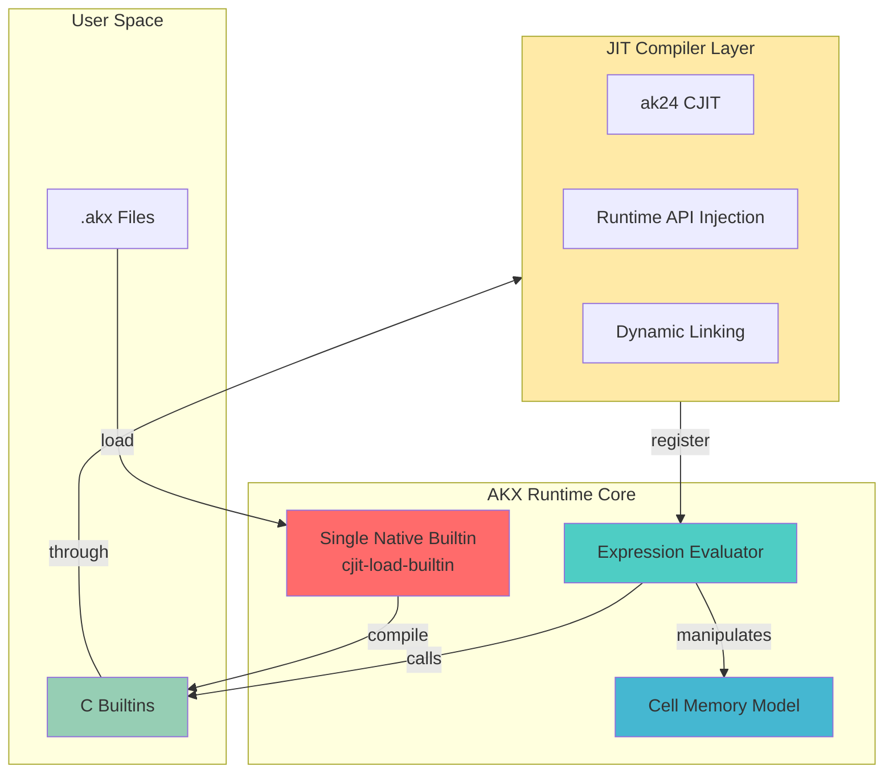

## Bootstrap Flow

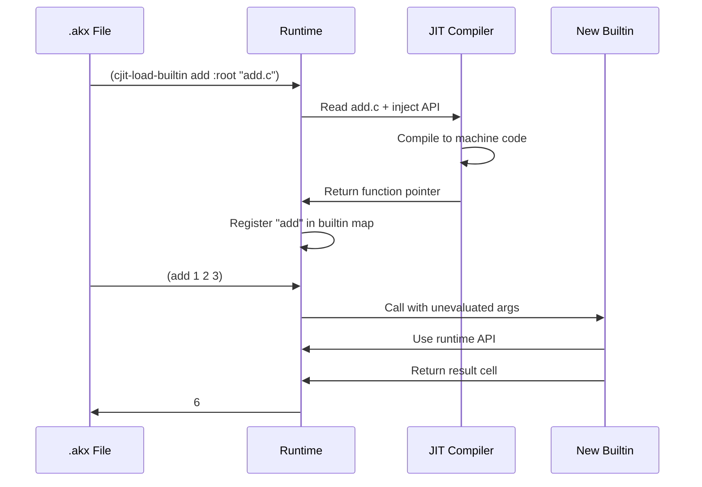

## Cell Memory Model

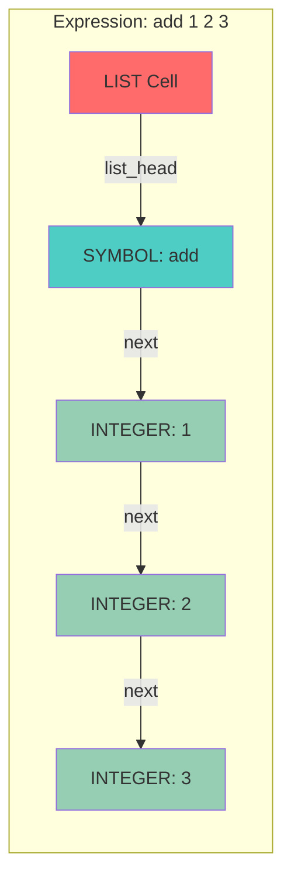

## The Power Move: Hot Reloading

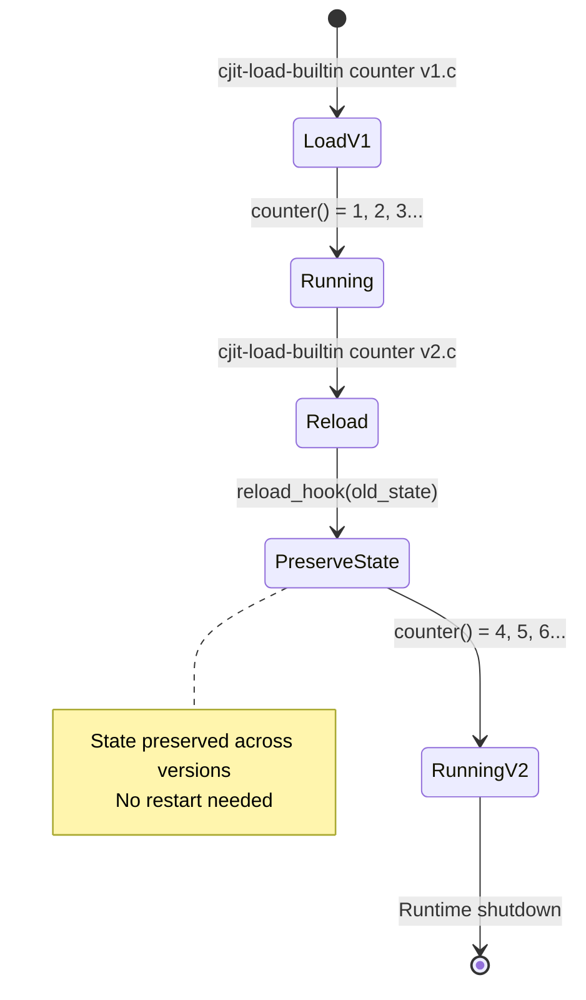

## Compilation Pipeline

```mermaid
flowchart LR
    subgraph Input
        Root[Root C File]
        Impl[Implementation Files]
        Headers[Include Paths]
    end
    
    subgraph Compile[JIT Compilation]
        API[Inject Runtime API]
        Combine[Combine Sources]
        Defines[Apply Defines]
        Compile2[Compile to Machine Code]
    end
    
    subgraph Link[Dynamic Linking]
        Symbols[Link Runtime Symbols]
        Libs[Link Libraries]
        Relocate[Relocate Code]
    end
    
    subgraph Register[Registration]
        Extract[Extract Function Pointer]
        Hooks[Find Lifecycle Hooks]
        Map[Add to Builtin Map]
    end
    
    Input --> Compile
    Compile --> Link
    Link --> Register
    Register --> Callable[Callable from AKX]
    
    style Compile fill:#ffeaa7
    style Link fill:#ff6b6b
    style Register fill:#4ecdc4
    style Callable fill:#96ceb4
```

## Keyword Argument System

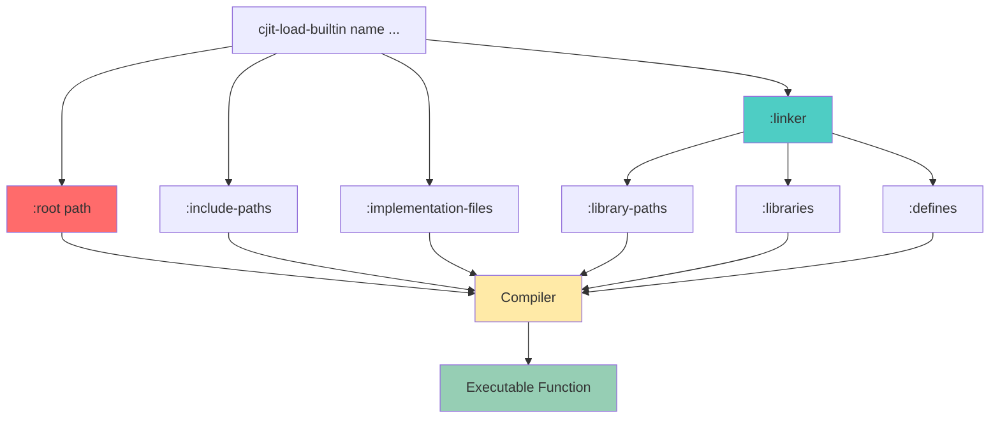

## The Minimal Core Principle

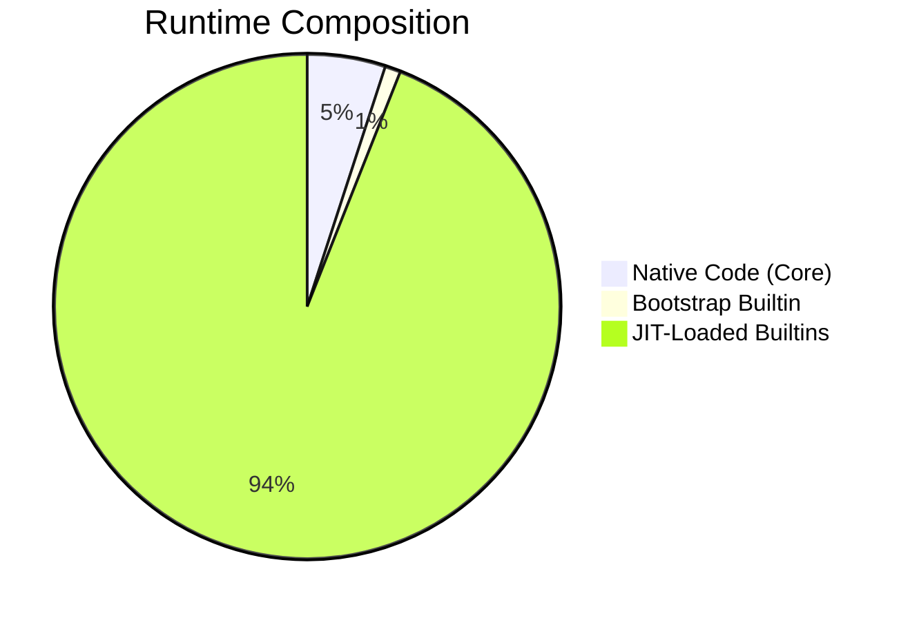

**One native builtin. Everything else is JIT-compiled at runtime.**

## Module Lifecycle

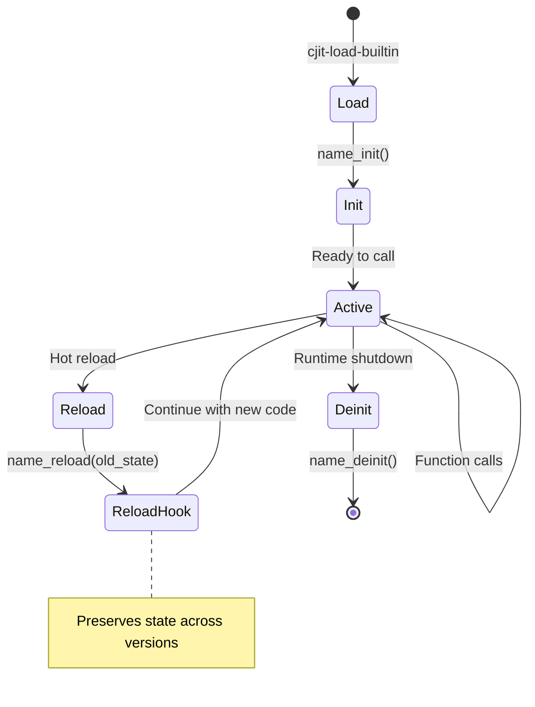

## What Makes This Special

### Traditional Language
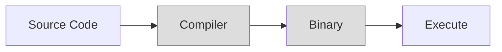

### AKX
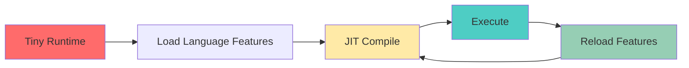

**The language defines itself. At runtime. Repeatedly.**

## Data Flow

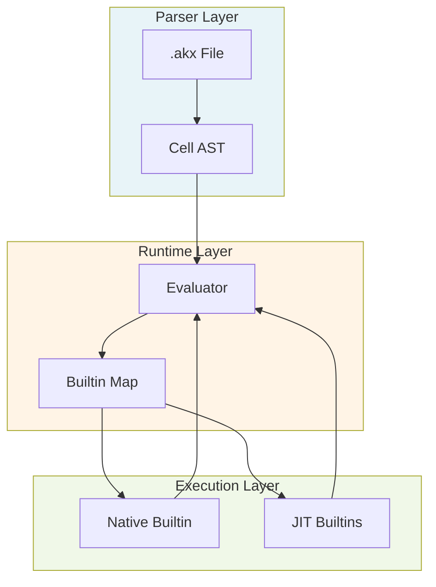

