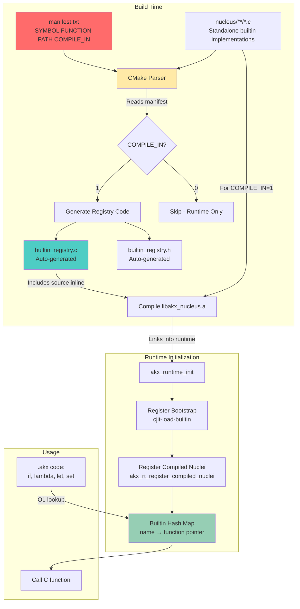
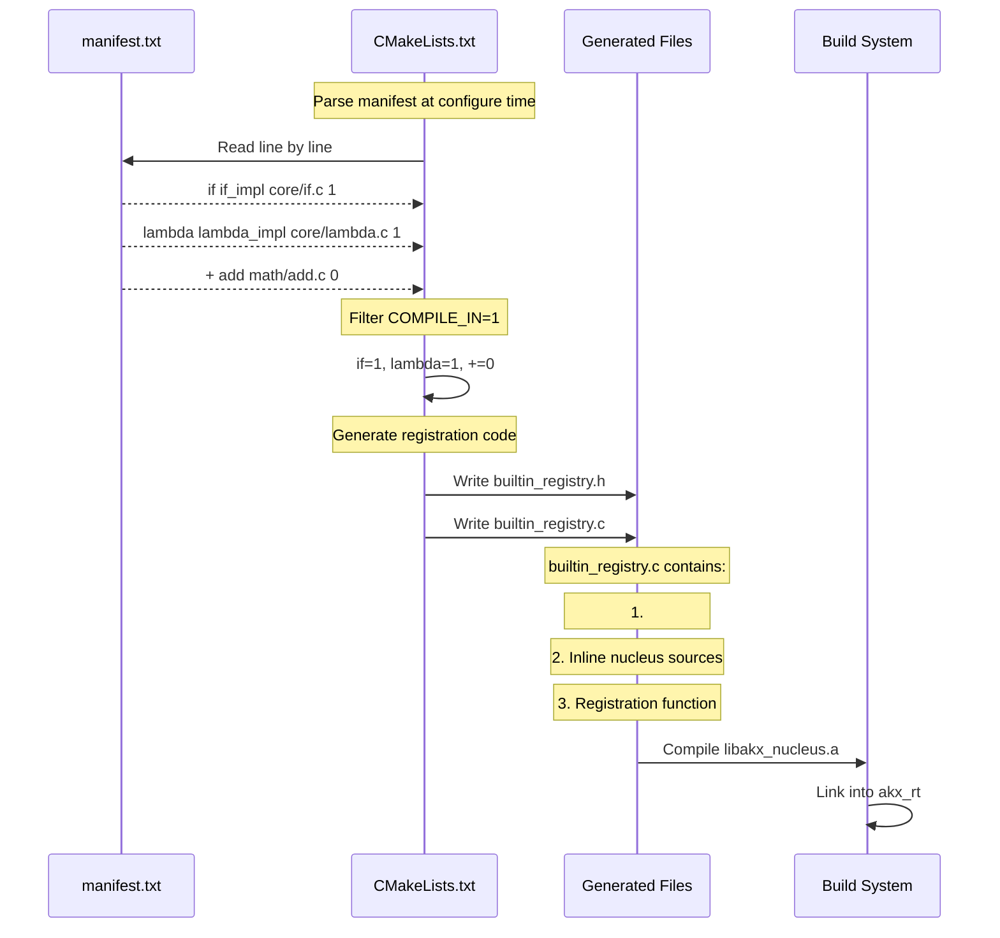
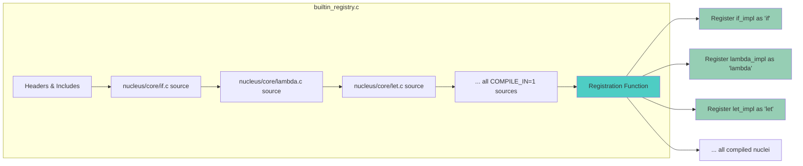
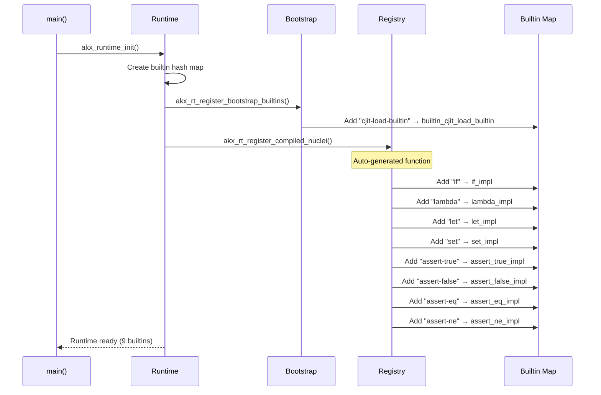
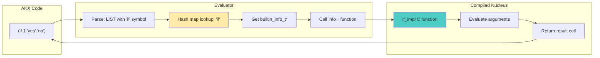
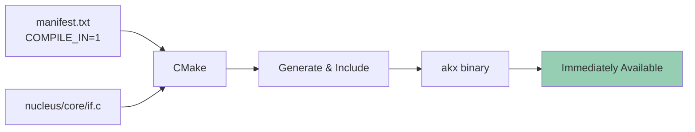
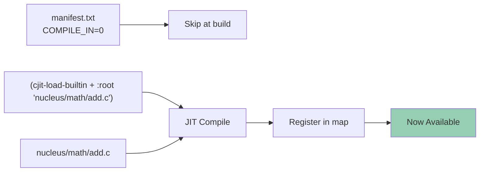
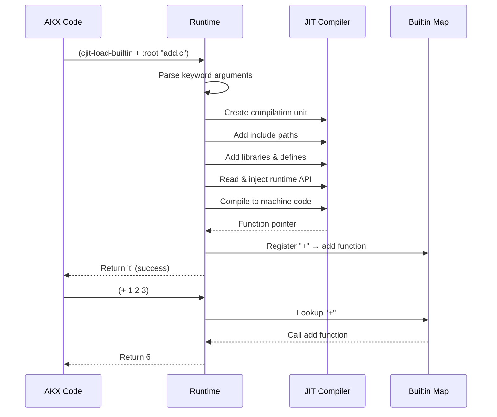

# AKX Nucleus System

**A unified builtin architecture where language features are standalone C files that can be compiled-in or loaded at runtime.**

## The Big Picture



## The Manifest: Single Source of Truth

```
nucleus/manifest.txt
────────────────────────────────────────────────
SYMBOL      FUNCTION        PATH              COMPILE_IN
if          if_impl         core/if.c         1
lambda      lambda_impl     core/lambda.c     1
+           add             math/add.c        0
println     println         io/println.c      0
```

**COMPILE_IN values:**
- `1` = Compile into binary (always available)
- `0` = Load at runtime via `cjit-load-builtin`

## CMake Code Generation Flow



## Generated Registry Structure



## Runtime Registration



## Execution Flow



## The Two Deployment Modes

### Mode 1: Compiled-In (COMPILE_IN=1)



**Pros:** Instant availability, faster (no JIT)  
**Cons:** Slightly larger binary

### Mode 2: Runtime-Loadable (COMPILE_IN=0)



**Pros:** Smaller binary, load on demand, hot-reloadable  
**Cons:** Requires explicit loading

## Key Files

```
nucleus/
├── manifest.txt              ← Define all nuclei here
├── CMakeLists.txt           ← Parses manifest, generates code
├── core/if.c                ← Standalone nucleus implementation
├── core/lambda.c
└── ...

build/generated/
├── builtin_registry.h       ← Auto-generated header
└── builtin_registry.c       ← Auto-generated registration code

pkg/rt/
├── akx_rt.c                 ← Calls registration functions
└── akx_rt_builtins.c        ← Only bootstrap loader
```

## Adding a New Nucleus


That's it! The system handles everything else automatically.

---

## Runtime Loading: `cjit-load-builtin` Options

For nuclei with `COMPILE_IN=0` (or any custom C code), use `cjit-load-builtin` to load at runtime:

### Basic Usage

```lisp
(cjit-load-builtin SYMBOL :root "path/to/file.c")
```

**Example:**
```lisp
(cjit-load-builtin + :root "nucleus/math/add.c" :as "add")
(+ 1 2 3)  ; Now available
```

### All Keyword Arguments

| Keyword | Type | Required | Description |
|---------|------|----------|-------------|
| `:root` | string | ✅ Yes | Path to main C file containing the builtin function |
| `:as` | string | ❌ No | Override C function name (default: same as SYMBOL) |
| `:include-paths` | list | ❌ No | Additional header search directories |
| `:implementation-files` | list | ❌ No | Extra C files to compile (relative to :root) |
| `:linker` | map | ❌ No | Linker configuration (libraries, defines, etc.) |

### Advanced Example: Multi-File Builtin with Dependencies

```lisp
(cjit-load-builtin http-client
    :root "builtins/http/client.c"
    
    :include-paths {
        "/usr/local/include"
        "/opt/custom/headers"
    }
    
    :implementation-files {
        "parser.c"
        "connection.c"
        "utils.c"
    }
    
    :linker {
        :library-paths { "/usr/local/lib" }
        :libraries { "curl" "ssl" "crypto" }
        :defines {
            ["DEBUG" "1"]
            ["VERSION" "\"1.0.0\""]
            ["ENABLE_LOGGING" ""]
        }
    })
```

### Linker Sub-Options

Within `:linker { ... }`:

| Sub-Keyword | Type | Description | Example |
|-------------|------|-------------|---------|
| `:library-paths` | list | Directories to search for libraries | `{ "/usr/local/lib" }` |
| `:libraries` | list | Library names (without `lib` prefix/extension) | `{ "m" "pthread" }` |
| `:defines` | list of pairs | Preprocessor defines as `[NAME VALUE]` | `{["DEBUG" "1"] ["FLAG" ""]}` |

### Common Patterns

**Load math operator:**
```lisp
(cjit-load-builtin + :root "nucleus/math/add.c" :as "add")
```

**Load with math library:**
```lisp
(cjit-load-builtin sqrt 
    :root "nucleus/math/sqrt.c"
    :linker { :libraries { "m" } })
```

**Load with custom defines:**
```lisp
(cjit-load-builtin logger
    :root "builtins/logger.c"
    :linker {
        :defines {
            ["LOG_LEVEL" "3"]
            ["ENABLE_COLORS" "1"]
        }
    })
```

**Multi-file builtin:**
```lisp
(cjit-load-builtin json
    :root "builtins/json/main.c"
    :implementation-files {
        "parser.c"
        "encoder.c"
    })
```

### How It Works



### Hot Reloading

Even compiled-in nuclei can be replaced:

```lisp
(cjit-load-builtin if :root "nucleus/core/if_v2.c" :as "if_impl")
```

The old version (compiled or JIT) is immediately replaced with the new one!

