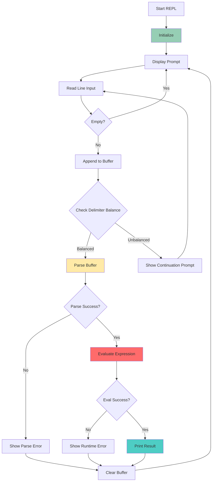

# AKX REPL Implementation Plan

## Overview

Implement a cross-platform, UTF-8 compliant REPL (Read-Eval-Print Loop) for AKX that respects the language's virtual paren semantics and provides an intuitive interactive experience.

## Core Design Principles

### Virtual Paren Semantics

AKX supports two expression modes:
1. **Explicit lists**: `(add 1 2)`, `[1 2 3]`, `{key value}`, `<template>`
2. **Virtual lists**: `add 1 2` (implicit parens, newline-terminated)

**REPL Submission Rules:**
- If **any** opening delimiter `(`, `[`, `{`, or `<` is unmatched → **multi-line mode** (Enter does NOT submit)
- If **no** explicit list is started → **single-line mode** (Enter submits immediately)
- Empty lines always submit (even in multi-line mode)

**Important**: Virtual lists can contain nested explicit lists that span multiple lines. The REPL only cares about delimiter balance, not whether you're in a virtual or explicit list context.

### Examples

```lisp
akx> let x 10          ← submits immediately (virtual list)
x = 10

akx> (let y            ← multi-line mode (unmatched paren)
...>   20)             ← submits when parens balanced
y = 20

akx> [1 2              ← multi-line mode (unmatched bracket)
...>  3 4]             ← submits when brackets balanced
[1 2 3 4]

akx> add 1 2           ← submits immediately (virtual list)
3

akx> add 1 2 (add 6 7  ← multi-line mode (virtual list with unmatched paren)
...> 8 9) 99 3         ← submits when paren balanced
                       ← Result: virtual list with nested explicit list
```

**Key Insight**: The REPL doesn't need to understand virtual vs explicit list semantics. It only needs to track delimiter balance. The parser handles the virtual list logic when the balanced input is submitted.

## Architecture



## Implementation Components

### 1. Input Buffer Management

**File: `cmd/akx/repl_buffer.h/c`**

```c
typedef struct {
    ak_buffer_t *content;
    size_t line_count;
    int paren_depth;      // ( )
    int bracket_depth;    // [ ]
    int brace_depth;      // { }
    int temple_depth;     // < >
} repl_buffer_t;

repl_buffer_t *repl_buffer_new(void);
void repl_buffer_free(repl_buffer_t *buf);
void repl_buffer_append_line(repl_buffer_t *buf, const char *line);
void repl_buffer_clear(repl_buffer_t *buf);
bool repl_buffer_is_balanced(repl_buffer_t *buf);
bool repl_buffer_is_empty(repl_buffer_t *buf);
```

**Delimiter Tracking:**
- Track depth of each delimiter type
- Ignore delimiters inside string literals (`"..."`)
- Handle escape sequences (`\"`, `\\`)
- Balance check: all depths must be 0

### 2. Cross-Platform Line Input

**File: `cmd/akx/repl_input.h/c`**

Use platform-specific APIs for line editing:

**POSIX (Linux/macOS):**
```c
#ifdef AK24_PLATFORM_POSIX
#include <termios.h>
#include <unistd.h>

// Raw mode for character-by-character input
// Support arrow keys, backspace, delete
// UTF-8 aware cursor movement
#endif
```

**Windows:**
```c
#ifdef AK24_PLATFORM_WINDOWS
#include <windows.h>
#include <conio.h>

// Use ReadConsoleW for UTF-16 input
// Convert to UTF-8 for internal processing
// Support Windows console editing keys
#endif
```

**API:**
```c
typedef struct repl_input_ctx_t repl_input_ctx_t;

repl_input_ctx_t *repl_input_init(void);
void repl_input_deinit(repl_input_ctx_t *ctx);

char *repl_input_read_line(repl_input_ctx_t *ctx, const char *prompt);
void repl_input_add_history(repl_input_ctx_t *ctx, const char *line);
```

### 3. UTF-8 Support

**Leverage AK24's UTF-8 Infrastructure:**

AK24 buffers are UTF-8 aware:
- `ak_buffer_t` stores raw UTF-8 bytes
- `ak_scanner_t` handles UTF-8 in symbols/strings
- Source location tracking works with UTF-8

**REPL Requirements:**
- Accept UTF-8 input from terminal
- Display UTF-8 output correctly
- Handle multi-byte characters in editing (cursor position)
- Preserve UTF-8 in history

**Platform Considerations:**
- **POSIX**: Terminals are typically UTF-8 by default
- **Windows**: Use `SetConsoleOutputCP(CP_UTF8)` and wide char APIs

### 4. Main REPL Loop

**File: `cmd/akx/repl.c` (replace stub)**

```c
#include "repl_buffer.h"
#include "repl_input.h"
#include "akx.h"
#include <ak24/kernel.h>

int akx_repl_start(void) {
    printf("\nAKX REPL v0.1.0\n");
    printf("Type expressions or press Ctrl+C to exit\n\n");
    
    akx_core_t *core = akx_core_init();
    if (!core) {
        printf("Error: Failed to initialize AKX core\n");
        return 1;
    }
    
    akx_runtime_ctx_t *runtime = akx_runtime_init();
    if (!runtime) {
        printf("Error: Failed to initialize AKX runtime\n");
        akx_core_deinit(core);
        return 1;
    }
    
    repl_input_ctx_t *input_ctx = repl_input_init();
    repl_buffer_t *buffer = repl_buffer_new();
    
    while (1) {
        const char *prompt = repl_buffer_is_empty(buffer) ? "akx> " : "...> ";
        char *line = repl_input_read_line(input_ctx, prompt);
        
        if (!line) {
            break;  // EOF or error
        }
        
        if (strlen(line) == 0) {
            free(line);
            if (repl_buffer_is_empty(buffer)) {
                continue;
            }
            // Empty line with content submits
        } else {
            repl_buffer_append_line(buffer, line);
            free(line);
        }
        
        if (!repl_buffer_is_balanced(buffer)) {
            continue;  // Need more input
        }
        
        // Parse and evaluate
        ak_buffer_t *code_buf = buffer->content;
        akx_parse_result_t result = akx_cell_parse_buffer(code_buf, "<repl>");
        
        if (result.errors) {
            // Show parse errors
            akx_parse_error_t *err = result.errors;
            while (err) {
                printf("Parse error: %s\n", err->message);
                err = err->next;
            }
        } else if (list_count(&result.cells) > 0) {
            // Evaluate
            if (akx_runtime_start(runtime, &result.cells) != 0) {
                // Show runtime errors
                akx_parse_error_t *err = akx_runtime_get_errors(runtime);
                while (err) {
                    printf("Runtime error: %s\n", err->message);
                    err = err->next;
                }
            }
        }
        
        akx_parse_result_free(&result);
        repl_buffer_clear(buffer);
    }
    
    repl_buffer_free(buffer);
    repl_input_deinit(input_ctx);
    akx_runtime_deinit(runtime);
    akx_core_deinit(core);
    
    printf("\nGoodbye!\n");
    return 0;
}
```

### 5. Delimiter Balance Tracking

**Algorithm:**

```c
bool repl_buffer_is_balanced(repl_buffer_t *buf) {
    if (!buf || !buf->content) return true;
    
    int paren = 0, bracket = 0, brace = 0, temple = 0;
    bool in_string = false;
    bool escape_next = false;
    
    uint8_t *data = ak_buffer_data(buf->content);
    size_t len = ak_buffer_count(buf->content);
    
    for (size_t i = 0; i < len; i++) {
        uint8_t c = data[i];
        
        if (escape_next) {
            escape_next = false;
            continue;
        }
        
        if (c == '\\' && in_string) {
            escape_next = true;
            continue;
        }
        
        if (c == '"') {
            in_string = !in_string;
            continue;
        }
        
        if (in_string) {
            continue;  // Ignore delimiters in strings
        }
        
        // Track delimiters
        switch (c) {
            case '(': paren++; break;
            case ')': paren--; break;
            case '[': bracket++; break;
            case ']': bracket--; break;
            case '{': brace++; break;
            case '}': brace--; break;
            case '<': temple++; break;
            case '>': temple--; break;
        }
    }
    
    buf->paren_depth = paren;
    buf->bracket_depth = bracket;
    buf->brace_depth = brace;
    buf->temple_depth = temple;
    
    return (paren == 0 && bracket == 0 && brace == 0 && temple == 0);
}
```

### 6. History Management

**File: `cmd/akx/repl_history.h/c`**

```c
typedef struct {
    list_str_t entries;
    size_t max_entries;
    size_t current_index;
} repl_history_t;

repl_history_t *repl_history_new(size_t max_entries);
void repl_history_free(repl_history_t *hist);
void repl_history_add(repl_history_t *hist, const char *entry);
const char *repl_history_prev(repl_history_t *hist);
const char *repl_history_next(repl_history_t *hist);
void repl_history_save(repl_history_t *hist, const char *filepath);
void repl_history_load(repl_history_t *hist, const char *filepath);
```

**History File:**
- Location: `~/.akx/history` (use `ak_filepath_home()`)
- Format: One entry per line, UTF-8 encoded
- Max 1000 entries (configurable)

### 7. Enhanced Features (Future)

**Tab Completion:**
- Complete builtin names
- Complete variable names from current scope
- Complete file paths for `import`

**Syntax Highlighting:**
- Color builtins differently
- Highlight strings, numbers
- Show matching delimiters

**Multi-line Editing:**
- Arrow up/down through history
- Arrow left/right within line
- Home/End keys
- Ctrl+A (beginning), Ctrl+E (end)

## Build Integration

**Update `cmd/akx/CMakeLists.txt`:**

```cmake
add_executable(akx
    main.c
    akx.c
    commands.c
    repl.c
    repl_buffer.c
    repl_input.c
    repl_history.c
    nucleus_info.c
    nucleus_list.c
    help.c
)
```

## Testing Strategy

### Unit Tests

**Test `repl_buffer_is_balanced()`:**
```c
assert(repl_buffer_is_balanced("(add 1 2)"));
assert(!repl_buffer_is_balanced("(add 1 2"));
assert(repl_buffer_is_balanced("[1 2 3]"));
assert(!repl_buffer_is_balanced("{key"));
assert(repl_buffer_is_balanced("\"(not a paren)\""));
```

### Integration Tests

**Test REPL session:**
```bash
echo -e "let x 10\nx\n(add x 20)\n" | akx
# Expected output:
# akx> x = 10
# akx> 10
# akx> 30
```

## Platform-Specific Considerations

### POSIX (Linux/macOS)

**Terminal Control:**
```c
struct termios orig_termios;

void enable_raw_mode(void) {
    tcgetattr(STDIN_FILENO, &orig_termios);
    struct termios raw = orig_termios;
    raw.c_lflag &= ~(ECHO | ICANON);
    tcsetattr(STDIN_FILENO, TCSAFLUSH, &raw);
}

void disable_raw_mode(void) {
    tcsetattr(STDIN_FILENO, TCSAFLUSH, &orig_termios);
}
```

**Signal Handling:**
- Ctrl+C: Clear current line, don't exit
- Ctrl+D: Exit REPL (EOF)
- Integrate with existing AK24 signal handlers

### Windows

**Console Setup:**
```c
void setup_windows_console(void) {
    SetConsoleOutputCP(CP_UTF8);
    SetConsoleCP(CP_UTF8);
    
    HANDLE hOut = GetStdHandle(STD_OUTPUT_HANDLE);
    DWORD dwMode = 0;
    GetConsoleMode(hOut, &dwMode);
    dwMode |= ENABLE_VIRTUAL_TERMINAL_PROCESSING;
    SetConsoleMode(hOut, dwMode);
}
```

**Input Handling:**
```c
wchar_t wbuf[1024];
DWORD read;
ReadConsoleW(GetStdHandle(STD_INPUT_HANDLE), wbuf, 1024, &read, NULL);

// Convert UTF-16 to UTF-8
char utf8_buf[4096];
WideCharToMultiByte(CP_UTF8, 0, wbuf, read, utf8_buf, 4096, NULL, NULL);
```

## Error Handling

### Parse Errors
- Show error with source location
- Highlight problematic code
- Don't exit REPL, clear buffer and continue

### Runtime Errors
- Show error message
- Show stack trace if available
- Don't exit REPL, continue

### System Errors
- Terminal I/O errors: exit gracefully
- Memory allocation errors: exit with message
- Signal interrupts: handle appropriately

## Performance Considerations

- **Buffer reuse**: Don't reallocate buffer on each line
- **Lazy parsing**: Only parse when balanced
- **Efficient delimiter tracking**: Single pass, O(n)
- **History limit**: Cap at 1000 entries to prevent memory growth

## Dependencies

**AK24 Modules Used:**
- `ak24/buffer.h` - Input buffer management
- `ak24/scanner.h` - UTF-8 aware parsing
- `ak24/filepath.h` - History file path
- `ak24/kernel.h` - Platform detection, memory
- `ak24/list.h` - History storage

**System Libraries:**
- **POSIX**: `<termios.h>`, `<unistd.h>`
- **Windows**: `<windows.h>`, `<conio.h>`

## Implementation Phases

### Phase 1: Basic REPL (MVP)
- Simple line input (no editing)
- Delimiter balance checking
- Parse and evaluate
- Error display

### Phase 2: Line Editing
- Backspace, delete
- Arrow keys (left/right)
- Home/End keys

### Phase 3: History
- Up/down arrow navigation
- Persistent history file
- History search (Ctrl+R)

### Phase 4: Advanced Features
- Tab completion
- Syntax highlighting
- Multi-line editing improvements

## Success Criteria

- ✅ Cross-platform (Windows, Linux, macOS)
- ✅ UTF-8 compliant input/output
- ✅ Respects virtual paren semantics
- ✅ Intuitive multi-line editing
- ✅ Persistent history
- ✅ Graceful error handling
- ✅ No memory leaks
- ✅ Responsive (< 10ms input lag)

## References

- AKX Parser: `pkg/cell/akx_cell.c` (virtual list parsing)
- AK24 Buffer: `~/.ak24/include/ak24/buffer.h`
- AK24 Scanner: `~/.ak24/include/ak24/scanner.h`
- Platform Detection: `~/.ak24/include/ak24/kernel.h`

